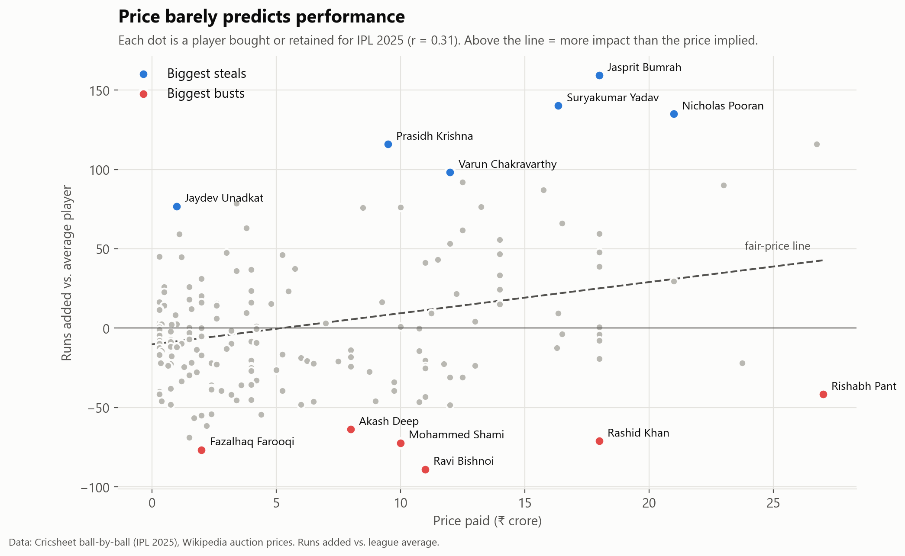
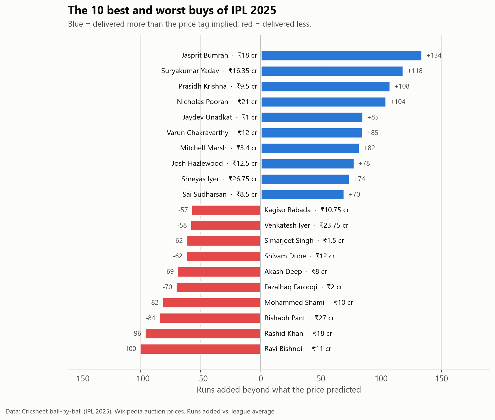
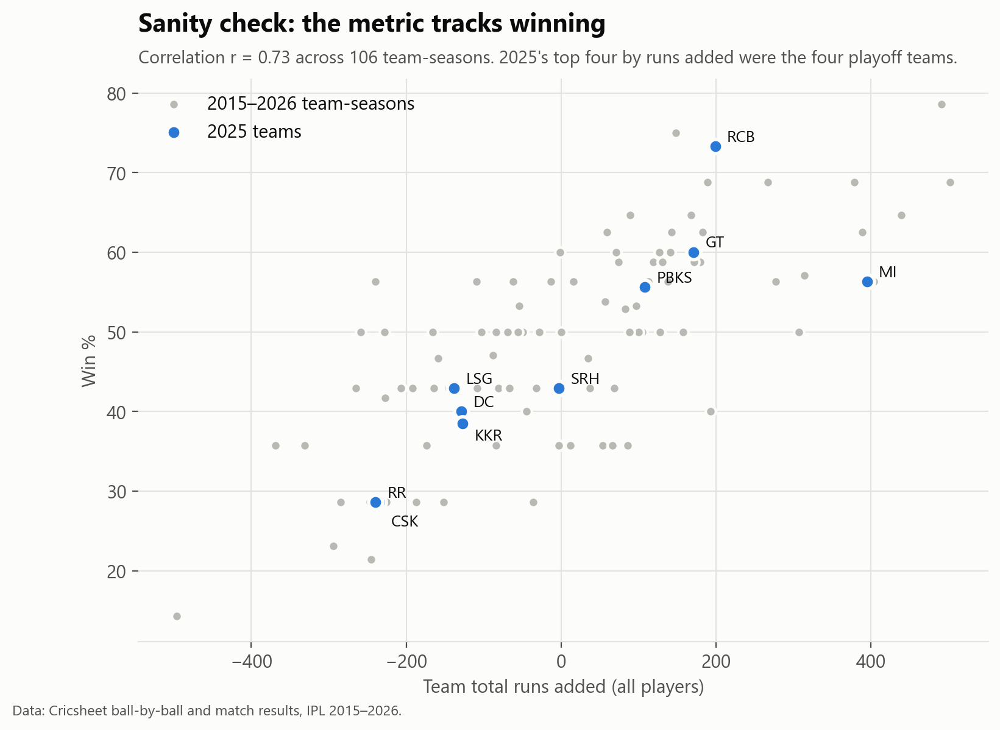
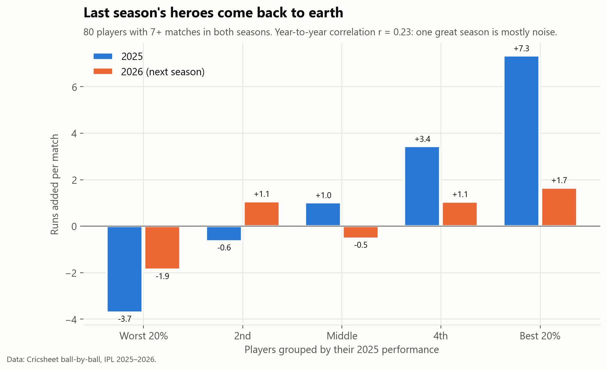

# Moneyball IPL: which ₹-crore buys were busts, and which were steals?

**Question:** IPL franchises spent about ₹1,180 crore on 226 players before the 2025 season. Did the money go to the players who actually won matches?

**Short answer:** Not really. Price explains only about **10% of the variation** in on-field impact (r = 0.31). A third of the cheap buys never played a match. And one great season says surprisingly little about the next.



---

## Key findings

| # | Finding | Evidence |
|---|---|---|
| 1 | **Price is a weak signal.** Expensive players are better on average, but plenty of ₹10 cr+ players added nothing, and some ₹1 cr players were among the best in the league. | r = 0.31 between price and runs added (226 players) |
| 2 | **The best value was elite bowling.** Bumrah, Prasidh Krishna, Varun Chakravarthy and Hazlewood each delivered 75–135 more runs of value than their price predicted. Jaydev Unadkat (₹1 cr) and Mitchell Marsh (₹3.4 cr) were the stand-out bargains. | [Steals and busts chart](images/02_steals_and_busts.png) |
| 3 | **The costliest flops:** Ravi Bishnoi (₹11 cr), Rashid Khan (₹18 cr) and Rishabh Pant (₹27 cr, a record auction price at the time) all cost their teams runs compared with an average player. | Same chart |
| 4 | **Mid-priced players were the weakest band.** Only 33% of ₹3–10 cr players who took the field beat an average player, compared with 58% of marquee players. And 36% of budget buys never played at all. | [Price band chart](images/03_price_bands.png) |
| 5 | **Last season's heroes regress.** The top 20% of players in 2025 added +7.3 runs per match. The same players added just +1.7 in 2026. Bidding big on one hot season is risky. | Year-to-year r = 0.23 (80 players) |



## Method

**The metric: Runs Added.** Every ball is compared with what a league-average player would have done on that ball, in the same season and the same phase of the innings (powerplay, middle overs or death overs).

- **Batting:** (runs scored − expected runs) − 6 × (dismissals − expected dismissals)
- **Bowling:** (expected runs conceded − runs conceded) + 6 × (wickets − expected wickets)

An average player scores 0, and the whole league sums to exactly 0 each season (checked in SQL).

**Value.** A linear "fair price" line is fitted through runs added against price. A player's **surplus** is how far they landed above or below that line.

**Checks that the metric means something:**
- **It predicts winning.** Across 106 team-seasons (2015–2026), team total runs added correlates **r = 0.73** with win %. In 2025, the top four teams by runs added were exactly the four playoff teams.

  
- **It isn't sensitive to the wicket value.** Re-running with a wicket worth 3 or 10 runs instead of 6 leaves the rankings almost unchanged (Spearman ρ ≥ 0.97).
- **Name matching is auditable.** Auction names ("Ruturaj Gaikwad") are matched to scorecard names ("RD Gaikwad") within each team's roster, in this order: exact name, Cricsheet's alias register, surname plus first initial, then fuzzy matching. Four players needed manual fixes, each one documented in code. The 46 unmatched players were confirmed not to have played in 2025 (injury, withdrawal or bench).



## Limitations

- Fielding, captaincy and wicket-keeping aren't measured, so this undervalues players like MS Dhoni.
- One season is a small sample. Finding 5 shows how noisy single seasons are, so treat individual rankings as "what happened," not "true talent."
- Prices are 2025 mega-auction and retention prices. Mid-season replacement signings are excluded.
- Retention prices are partly set by league rules (fixed retention slabs), not open bidding.

## Tools and structure

**SQL (DuckDB)** for all modeling: CTEs, window functions (`RANK`, `NTILE`), `REGR_SLOPE`, NULL-safe logic. **Python (pandas)** for scraping, name matching and orchestration. **matplotlib** for charts.

```
ipl-moneyball/
├── sql/
│   ├── 01_deliveries.sql        # clean ball-by-ball view, phase + flags
│   ├── 02_baselines.sql         # league-average rates per season & phase
│   ├── 03_player_impact.sql     # Runs Added per player-season
│   ├── 04_value.sql             # price vs impact, fair-price line, surplus
│   ├── 05_team_validation.sql   # does the metric predict wins?
│   └── 06_persistence.sql       # 2025 → 2026 consistency
├── src/
│   ├── build_prices.py          # parse auction + retention tables from Wikipedia
│   ├── run_pipeline.py          # load data, run SQL, match names, export
│   └── charts.py
├── data/processed/              # output tables (CSV)
└── images/
```

**Data:** [Cricsheet](https://cricsheet.org/downloads/) IPL ball-by-ball (`ipl_csv2.zip`) and its [player register](https://cricsheet.org/register/), plus Wikipedia's [2025 IPL personnel changes](https://en.wikipedia.org/wiki/List_of_2025_Indian_Premier_League_personnel_changes).

---
*Data current to the end of IPL 2026. Cricsheet data is used under its open data licence (ODC-BY).*
